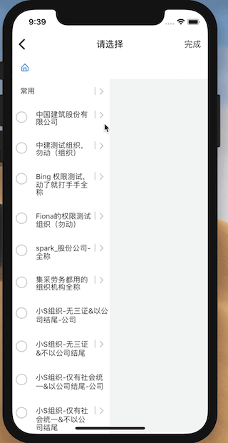

# ibuild-modal

Modal | 属性 | 说明
---- | ---|---
PageModal  | [PageModalProps](#pagemodalprops)| 页码切换modal
TreeModal | [TreeModalProps](#treemodalprops)| 层级选择modal 
TreeSelector | [TreeSelectorProps](#treeselectorprops) | 层级选择组件 


## Install

```bash
$ npm i @react-native-pure/ibuild-modal --save
```

## Documentaion

Quite easy to use TreeModal:





```
import React from 'react'
import {View,TouchableOpacity,Text,Alert} from 'react-native'
import {TreeModal,TreeSelectorModel}  from '@react-native-pure/ibuild-modal'
import update from "immutability-helper";


    constructor(props){
        super(props)
        this.state = {
            show:false,
            data:{	
                "sysNo": 1,
                "organizationCode": "1",
                "organizationFullName": "组织机构1",
                children:[{
                  "sysNo": 11,
                                "organizationCode": "11",
                                "organizationFullName": "组织机构11",
                  }]
                 	},
                 	 {
                 		"sysNo": 2,
                 		"organizationCode": "2",
                 		"organizationFullName": "组织机构2",
                 	}],
            selectedData:[],
            model:TreeSelectorModel.singleSelectAny
        }
    }

    updateState = (state: ImmutableHelperObject, callback: Function) => {
        if (this.state) {
            this.setState(
                update(this.state, state),
                callback
            );
        }
    }
    render(){
        return(<View style={{flex:1}}>
            <TouchableOpacity  style={{justifyContent: 'center',alignItems: 'center',flex:1}}
                               onPress={()=>{
                this.setState({
                    show:true
                })
            }}>
             <Text>show</Text>
            </TouchableOpacity>
            <TreeModal visible={this.state.show}
                       dataSource={this.state.data}
                       storageKey={"Key1"}
                       selectedDataSouce = {this.state.selectedData}
                       keyExtractor={(data)=>data.sysNo}
                       labelExtractor={(data)=>data.organizationFullName}
                       model={this.state.model}
                       onRequestClose={(info)=>{
                           this.setState({
                               show:false
                           })
                       }}
                       onChange={(currentItem,path)=>{
                           Alert.alert("change")
                       }}
                       onSelected={(currentItem,path)=>{
                           Alert.alert("选中")
                            this.updateState({
                                selectedData: {$push:[currentItem]}
                            })
                       }}
                       onUnSelected={(currentItem,path)=>{
                           Alert.alert(" 取消选中")
                           let index = this.state.selectedData.findIndex(x=>x.sysNo === currentItem.sysNo)
                           this.updateState({
                               selectedData: {$splice: [[index, 1]]}
                           })
                       }}
            />
        </View>)
    }

}

```


### TreeModal 

### TreeModalProps
- `dataSource` **Array<Object>** 
- `selectedDataSouce` **Array<Object>** 
- `loadDataFuc?` **(selectedItem:Object)=>Object**  点击网络数据
- `keyExtractor?` **(item: object) => string**  数据唯一标识，默认为 `sysNo`
- `labelExtractor?` **(item: object) => string**  显示文字的key,默认为`name`
- `model?` **()=>$Values<typeof [TreeSelectorModel](treeselectormodel)>**  选择模式，默认`singleSelectToEnd`
- `onChange?` **()=>(currentItem: Object,path:Array<Object>) => void**  选择改变时触发
- `onSelected?` **(currentItem: Object,path:Array<Object>) => void**  选中时触发
- `onUnSelected?` **(currentItem: Object,path:Array<Object>) => void** 取消选择时触发
- `lastSelectedPath?` **Array**  最后选择的全路径，如果提供将自动跳到上次选择的位置
- `maxLevel?` **number**  页最多显示多少列，默认为`10`
- `initLevel?` **number**  初始化显示列,默认为 `2`
- `storageKey?` **string**  提供一个字符串key用以保存历史选择数据以实现数据分离，如果不传的将使用默认key对历史选择数据进行保存
- `style?` **Object** 
- `onError?` **(message:string)=>void** 
- `hiddenHomeIcon?` **boolean**  是否隐藏header上home Icon
- `homeTitle?` **string** 初始化header 第一个位置的内容
- `showFullValue?` **boolean**  Item内容是否显示全路径
- `navbarStyle?` **[NavigationBarStyle](#navigationbarstyle)**
- `title?` **string**
- `onPressLeft?` **()=>void** 
- `onPressRight?` **()=>void** 
- `hiddenLeft?` **boolean** 
- `hiddenRight?` **boolean** 
- `renderLeft?` **React.ReactElement < any >** 
- `renderRight?` **React.ReactElement < any >** 
- `renderEmpty?` **React.ReactElement < any >** 


### TreeSelectorProps
- `dataSource` **Array<Object>** 
- `selectedDataSouce` **Array<Object>** 
- `loadDataFuc?` **(selectedItem:Object)=>Object**  点击网络数据
- `keyExtractor?` **(item: object) => string**  数据唯一标识，默认为 `sysNo`
- `labelExtractor?` **(item: object) => string**  显示文字的key,默认为`name`
- `model?` **()=>$Values<typeof [TreeSelectorModel](treeselectormodel)>**  选择模式，默认`singleSelectToEnd`
- `onChange?` **()=>(currentItem: Object,path:Array<Object>) => void**  选择改变时触发
- `onSelected?` **(currentItem: Object,path:Array<Object>) => void**  选中时触发
- `onUnSelected?` **(currentItem: Object,path:Array<Object>) => void** 取消选择时触发
- `lastSelectedPath?` **Array**  最后选择的全路径，如果提供将自动跳到上次选择的位置
- `maxLevel?` **number**  页最多显示多少列，默认为`10`
- `initLevel?` **number**  初始化显示列,默认为 `2`
- `storageKey?` **string**  提供一个字符串key用以保存历史选择数据以实现数据分离，如果不传的将使用默认key对历史选择数据进行保存
- `style?` **Object** 
- `onError?` **(message:string)=>void** 
- `hiddenHomeIcon?` **boolean**  是否隐藏header上home Icon
- `homeTitle?` **string** 初始化header 第一个位置的内容
- `showFullValue?` **boolean**  Item内容是否显示全路径
    

### PageModalProps
- `navbarStyle?` **[NavigationBarStyle](#navigationbarstyle)**
- `title?` **string**
- `onPressLeft?` **()=>void** 
- `onPressRight?` **()=>void** 
- `hiddenLeft?` **boolean** 
- `hiddenRight?` **boolean** 
- `renderLeft?` **React.ReactElement < any >** 
- `renderRight?` **React.ReactElement < any >** 

### NavigationBarStyle
####导航栏样式
- `title` **Object** title样式
- `leftButton` **Object** 左边按钮样式
- `rightButton` **Object** 右边按钮样式
- `contaner` **Object** 导航栏外层view样式

### TreeSelectorModel
####层级选择组件模式

 - `multiSelectToEnd`:"multiSelectToEnd" 多选，只有到最后一级
 - `multiSelectAny`:"multiSelectAny"  每一级都可以多选
 - `singleSelectToEnd`:"singleSelectToEnd" 单选，只有到最后一级
 - `singleSelectAny`:"singleSelectAny" 每一级都可以单选


### TransitionType 
####页面切换动画

 - `none`:"none" 没有动画
 - `horizontal`:"horizontal"  从右往左推出页面
 - `vertical`:"vertical" 从下往上推出页面

